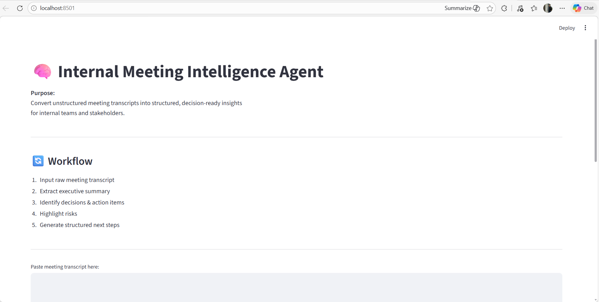
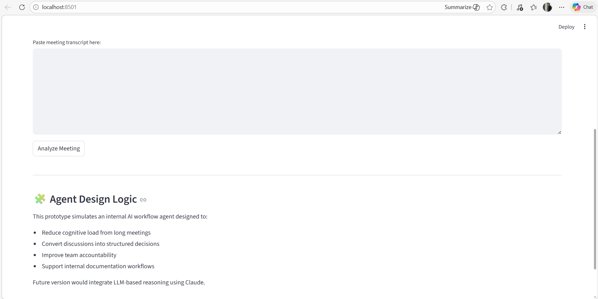
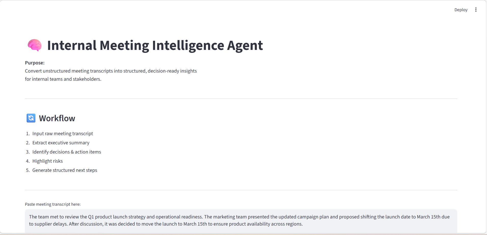
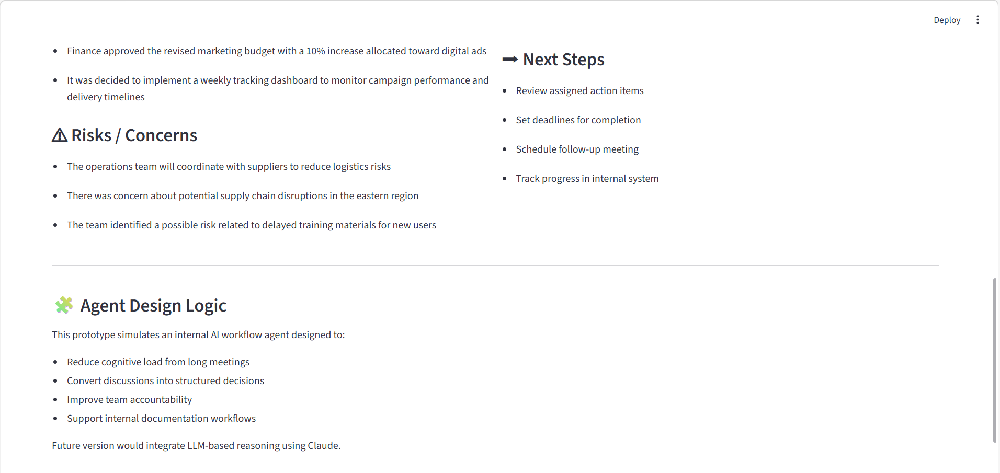

# 🧠 Internal Meeting Intelligence Agent

## Overview

Internal Meeting Intelligence Agent is a workflow automation prototype designed to transform raw meeting transcripts into structured, decision-ready insights for internal teams.

This tool simulates an internal AI agent that reduces cognitive load, improves accountability, and converts discussions into actionable outputs.

---

## 🔄 Workflow

1. Input raw meeting transcript
2. Extract executive summary
3. Identify key decisions
4. Detect action items
5. Highlight risks and concerns
6. Generate structured next steps

---

## 💡 Problem It Solves

In many organizations:
- Meetings are long and unstructured
- Action items get lost
- Decisions are undocumented
- Follow-ups are unclear

This agent converts unstructured discussions into structured internal documentation.

---

### 🏠 Home Interface Preview





### 📊 Output Interface Preview






## 🏗️ Architecture Overview

The system is designed as a modular internal AI workflow:

- `app.py` → Streamlit interface layer  
- `agent_logic.py` → Core intelligence processing  
- `Assets/` → UI preview assets  
- `requirements.txt` → Reproducible environment  

The architecture separates UI from logic, enabling easy scaling into:
- API deployment
- Slack / internal tool integration
- Enterprise workflow automation

---

## 📌 Output Sections

- Executive Summary
- Key Decisions
- Action Items
- Risks / Concerns
- Next Steps

---

## 🛠 Tech Stack

- Python
- Streamlit
- Modular architecture (app.py + agent_logic.py)

---

## 🚀 How to Run

```bash
pip install -r requirements.txt
streamlit run app.py
```

---

## 📈 Future Enhancements

- Claude API integration
- JSON export
- Slack integration
- Priority scoring
- Task assignment tagging

---

## 🎯 Project Relevance

This project demonstrates:

- Internal AI workflow thinking
- Agent-style structured outputs
- Automation design for teams
- Modular application development